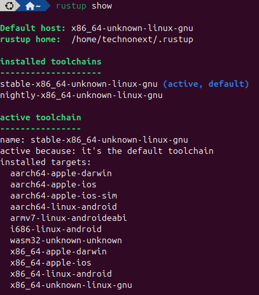

# Flutter Counter FRB

</img>
A Flutter counter app whose business logic lives in **Rust**, called from Dart via **FFI** and **flutter_rust_bridge v2**.

How the FFI bridge works:

```
Dart (counter_page.dart)
    │
    │  calls apis
    ▼
getCounter() / increment() / decrement() / reset()       ← api.dart
    │  
    │  Each of the api
    │  calls async method
    ▼
RustLib.instance.increment()        ← frb_generated.dart
    │
    │  DynamicLibrary.lookupFunction
    ▼
librust_lib.so / .dylib / .dll      ← compiled Rust
    │
    │  #[no_mangle] pub extern "C" fn increment() -> i64
    ▼
COUNTER (Mutex<i64>)                ← Rust global state
```

---

## Project Structure

```tree
flutter_counter_frb/
├── rust/                        # Rust crate
│   ├── Cargo.toml
│   └── src/
│       ├── api.rs               # Counter logic (increment / decrement / reset)
│       └── lib.rs               # Start point, mod api.rs
│
├── lib/
│   ├── main.dart                # Flutter app entry point
│   ├── counter_page.dart        # UI — calls Rust via FFI
│   ├── widgets                  # Widgets
│   └── src/
│       ├── loader
│       │   └── load_rust_library.dart   # Load rust library first at main()
│       └── rust                         # Generated folder
│           ├── api.dart                 # Re-export for clean imports
│           ├── frb_generated.dart
│           └── frb_generated.io.dart
│
├── android/app/
│   ├── build.gradle             # jniLibs config
│   └── src/main/jniLibs/        # .so files go here after build_android.sh
│       ├── arm64-v8a/
│       ├── armeabi-v7a/
│       └── x86_64/
│
├── ios/
│   ├── Flutter
│   ├── Runner
│   │   ├── AppDelegate.swift         # Use the `dummy` code from bridge_generated.h
│   │   ├── bridge_generated.h        # Generated C code from `rust` folder
│   │   └── Runner-Bridging-Header.h  # Imports "bridge_generated.h" here
│   ├── Runner.xcodeproj
│   └── Runner.xcworkspace
│
├── build_android.sh
├── build_ios.sh
├── build_linux.sh
├── build_macos.sh
├── flutter_rust_bridge.yaml        # flutter_rust_bridge_codegen config file
└── pubspec.yaml
```

---

## Prerequisites

| Tool                | Install                                      |
| ------------------- | -------------------------------------------- |
| Rust + Cargo        | https://rustup.rs                            |
| Flutter SDK ≥ 3.10  | https://docs.flutter.dev/get-started/install |
| cargo-ndk (Android) | `cargo install cargo-ndk`                    |
| Rust → Flutter code | `cargo install flutter_rust_bridge_codegen`  |
| Android NDK         | via Android Studio → SDK Manager             |
| cargo-lipo (iOS)    | `cargo install cargo-lipo`                   |
| Xcode (iOS/macOS)   | Mac App Store                                |

1. Terminal commands to properly install `rustc` on your device:

```bash
curl --proto '=https' --tlsv1.2 -sSf https://sh.rustup.rs | sh
source "$HOME/.cargo/env"

nano ~/.zshrc
export ANDROID_NDK_HOME=/home/technonext/Android/Sdk/ndk/30.0.14904198
```

2. Should show clean output like:

```bash
rustc --version
cargo --version
```

<span style="color: red;">\*\* Note: Avoid installing **`rustc`** through **`homebrew`**</span>

3. Add `Android` targets:

```bash
rustup target add aarch64-linux-android armv7-linux-androideabi x86_64-linux-android
```

4. Add `iOS` targets:

```bash
rustup target add aarch64-apple-ios x86_64-apple-ios aarch64-apple-ios-sim
```

5. Add `MacOS` targets:

```bash
rustup target add aarch64-apple-darwin x86_64-apple-darwin
```

6. To check all the `rustup` targets:
   </img>

```bash
rustup show
```

<span style="color: red;">\*\* Note: Avoid installing **`rustc`** through **`homebrew`**</span>

7. Install `flutter_rust_bridge_codegen`

```bash
cargo install flutter_rust_bridge_codegen
```

---

## Step 1 — Generate Dart bindings from Rust

Create a file name: `flutter_rust_bridge.yaml` inside the file copy this config code:

```yaml
rust_root: rust/
rust_input: crate::api
dart_output: lib/src/rust
c_output: rust/bridge_generated.h
dart_format_line_length: 100

# It should be true for properly bridge_generated.h generate
full_dep: true

# This prevents frb_generated.web.dart from being generated
web: false
```

Now, simply run this command app directory:

```bash
flutter_rust_bridge_codegen generate
```

---

## Step 2 — Build native library for different platforms

### Android

```bash
mkdir -p android/app/src/main/jniLibs/{arm64-v8a,armeabi-v7a,x86_64}
chmod +x build_android.sh
./build_android.sh
```

This places `.so` files into `android/app/src/main/jniLibs/`.

### iOS

```bash
chmod +x build_ios.sh
./build_ios.sh
open is/Runner.xcworkspace
```

**In Xcode:**

1. Runner → Build Phases → Link Binary With Libraries → + → Add $XCFRAMEWORK_NAME
2. Runner → Build Phases → Bundle Frameworks → + → Add $XCFRAMEWORK_NAME
3. Drag "bridge_generated.h" → Runner"
4. Open "Runner-Bridging-Header.h" → Add #import "bridge_generated.h"
5. Open "AppDelegare.swift" → Add these two lines of code:

```swift
        let dummy = dummy_method_to_enforce_bundling()
        print(dummy)
```

### macOS

```bash
chmod +x build_macos.sh
./build_macos.sh
open macos/Runner.xcworkspace
```

**In Xcode:**

1. Add _librust_lib.dylib_ to your Xcode project under\
   Runner → Build Phases → Link Binary with Libraries

2. Change _librust_lib.dylib_ Embed status in\
   General → Frameworks, Libraries, and Embedded Content → Embed & Sign

3. Run from _VSCode_ or _Android Studio_

### Linux

```bash
chmod +x build_linux.sh
./build_linux.sh
```

Next: Add the following to your linux/CMakeLists.txt

```txt
        # For initializing rust library
        set(RUST_LIB "${CMAKE_CURRENT_SOURCE_DIR}/../linux/librust_lib.so")
        install(FILES "${RUST_LIB}" DESTINATION "${INSTALL_BUNDLE_LIB_DIR}")
        target_link_libraries(${BINARY_NAME} PRIVATE "${RUST_LIB}")
```

---

## Step 3 — Run the Flutter app

```bash
flutter pub get
flutter run
```
